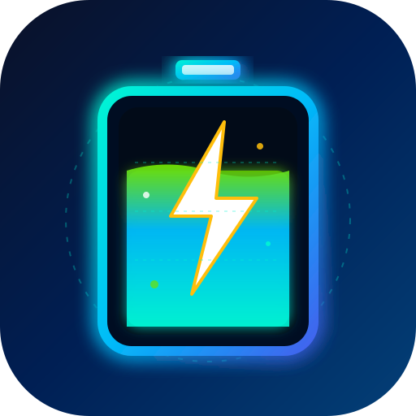
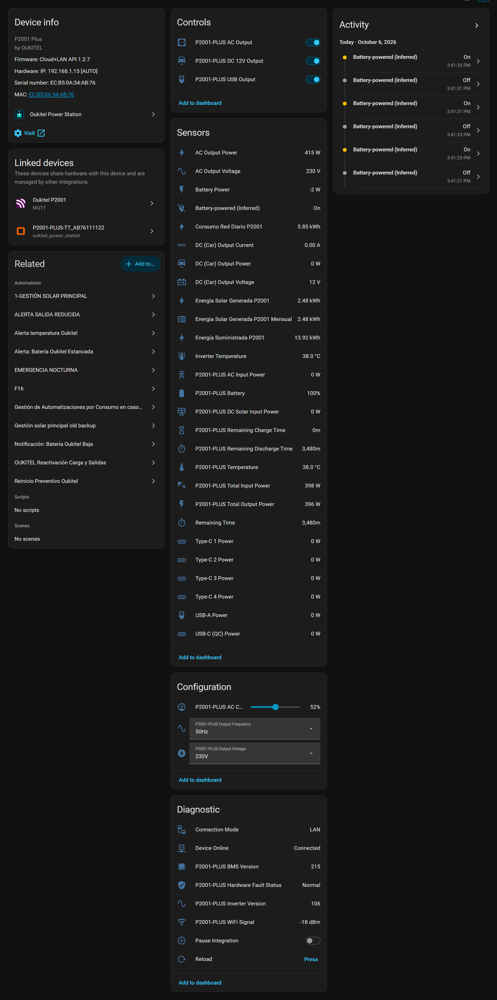
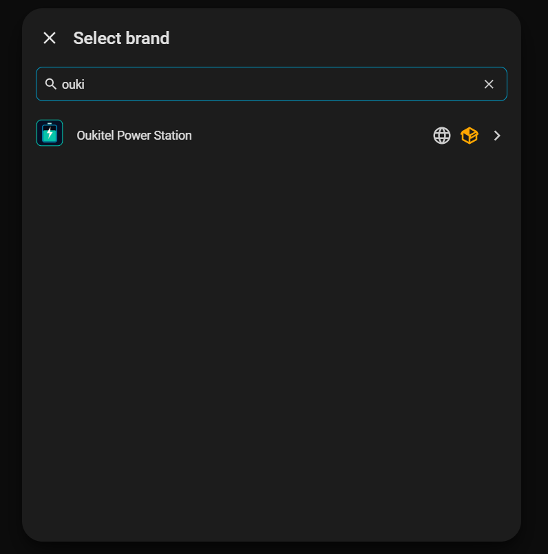
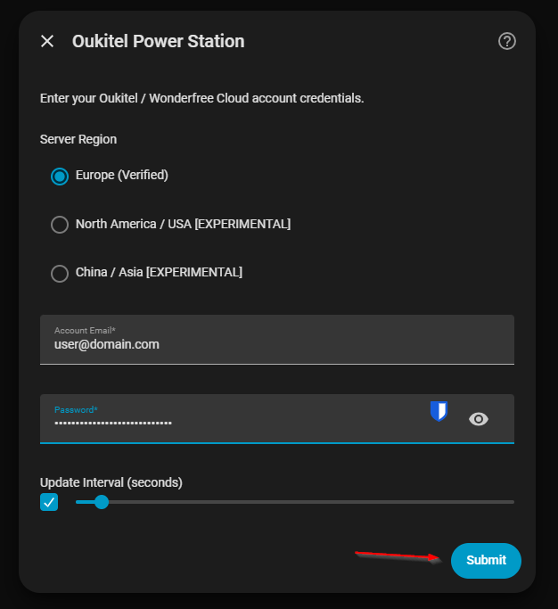
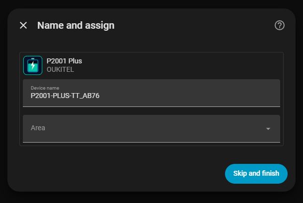
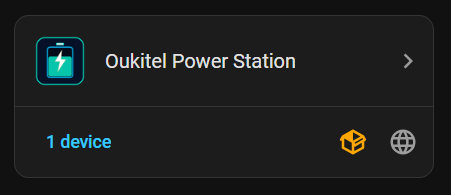
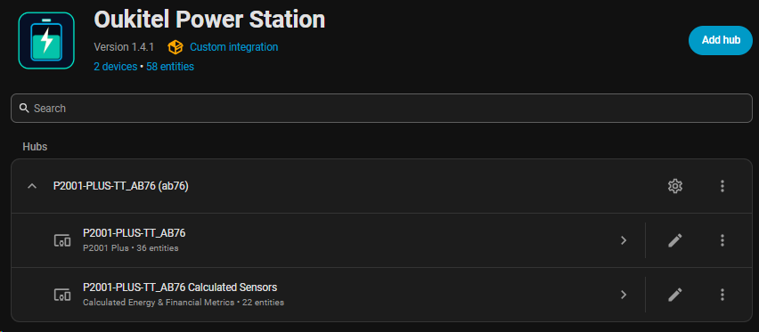
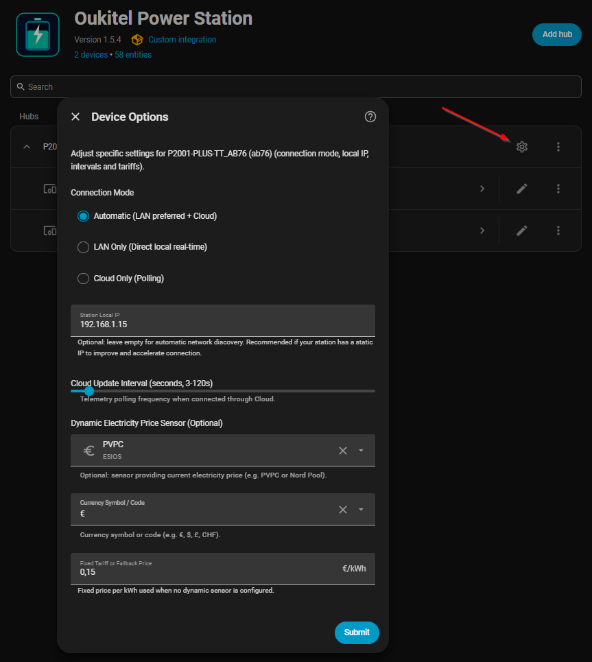

<div align="center">
  
  <h1>Oukitel Power Station Integration for Home Assistant</h1>

  [](https://github.com/hacs/default)
  [](https://github.com/VictorCV-DAM/ha-oukitel/releases)
  [](https://opensource.org/licenses/MIT)
  [](https://buymeacoffee.com/VictorCV)
  [](https://paypal.me/victorcava)
  [](https://ko-fi.com/victorcv)
</div>

Custom integration for Home Assistant to monitor and control **Oukitel Power Stations** (P2001 Plus, P2001, P5000, BP2000, etc.) via Cloud API without phone, emulator, or ADB.

---

## 👨‍💻 Author & Intellectual Property

- **Author & Maintainer:** Víctor C. V. ([@VictorCV-DAM](https://github.com/VictorCV-DAM))
- **Email:** `victorcvtrabajo@gmail.com`
- **Copyright:** © 2024-2026 Víctor C. V. All rights reserved.
- **License:** Released under the [MIT License](LICENSE).

---

## ✨ Features

- **100% Standalone**: No smartphone, emulator, or ADB required.
- **Interactive Bidirectional Switches**: Toggle AC, DC 12V, and USB directly from Home Assistant UI and automations with optimistic latching.
- **Dynamic Energy Icons**: Automatic real-time animated battery status icons showing charging vs discharging states at 10% steps.
- **Real-Time Telemetry**: Battery %, input power (Total, AC, Solar DC), output power, temperature, estimated times, Wi-Fi signal.
- **Autonomous Keep-Alive**: Automatically prevents the power station firmware from entering sleep mode.
- **Multi-Region Support**:
  - `EU` (Europe - Verified)
  - `US` (North America - [EXPERIMENTAL])
  - `CN` (China/Asia - [EXPERIMENTAL])
- **UI Config Flow**: Native setup directly from Home Assistant Settings -> Devices & Services.

---

## 📦 Installation via HACS

1. Open **HACS** in your Home Assistant.
2. Click the three dots in the top right corner and select **Custom repositories**.
3. Add this repository URL: `https://github.com/VictorCV-DAM/ha-oukitel` and category **Integration**.
4. Click **Download** and restart Home Assistant.
5. In Home Assistant, go to **Settings** -> **Devices & Services** -> **Add Integration** -> Search for **Oukitel Power Station**.
6. Enter your account email, password, and region.

---

## 📸 Screenshots & User Interface

<div align="center">
  <h3>⚡ Full Device Dashboard & Interactive Controls</h3>
  
  <p><i>Live telemetry: real-time battery status, bidirectional switches (AC, 12V DC, USB), input/output power, diagnostics, and frequency/voltage controls.</i></p>
</div>

<br/>

<div align="center">
  <table width="100%">
    <tr>
      <td width="50%" align="center">
        <b>1. Native Brand Search & Setup</b><br/><br/>
        <br/>
        <sub>Direct search in Home Assistant Add Integration flow.</sub>
      </td>
      <td width="50%" align="center">
        <b>2. Multi-Region Cloud Authentication</b><br/><br/>
        <br/>
        <sub>Region selection (EU/US/CN), email, password, and polling frequency.</sub>
      </td>
    </tr>
    <tr>
      <td width="50%" align="center">
        <b>3. Automatic Station Discovery</b><br/><br/>
        <br/>
        <sub>Discovers your station model, serial number, and allows naming/area assignment.</sub>
      </td>
      <td width="50%" align="center">
        <b>4. Integration Card & Connected Entities</b><br/><br/>
        <br/>
        <sub>Overview of the custom integration showing device status and 18 entities.</sub>
      </td>
    </tr>
    <tr>
      <td width="50%" align="center">
        <b>5. Device Management Hub</b><br/><br/>
        <br/>
        <sub>Hub entry point with direct access to options and diagnostics.</sub>
      </td>
      <td width="50%" align="center">
        <b>6. Dynamic Telemetry Frequency Options</b><br/><br/>
        <br/>
        <sub>Modify update polling interval (3-120s) on-the-fly without re-logging.</sub>
      </td>
    </tr>
  </table>
</div>

---

## 📊 Entities Provided

### Sensors (Telemetry & Diagnostics)
- `sensor.oukitel_battery`: Battery level (%) with dynamic charging icons
- `sensor.oukitel_total_input_power`: Total input (W)
- `sensor.oukitel_total_output_power`: Total output (W)
- `sensor.oukitel_ac_input_power`: AC charging input (W)
- `sensor.oukitel_dc_solar_input_power`: Solar DC input (W)
- `sensor.oukitel_temperature`: Station internal temperature (°C)
- `sensor.oukitel_remaining_discharge_time`: Estimated time remaining (min)
- `sensor.oukitel_remaining_charge_time`: Charge time remaining (min)
- `sensor.oukitel_wifi_signal`: Cloud Wi-Fi RSSI (dBm)
- `sensor.oukitel_bms_version`: BMS firmware version (e.g. 215)
- `sensor.oukitel_inverter_version`: Inverter firmware version (e.g. 106)

### Switches (Bidirectional Control)
- `switch.oukitel_ac_output`: Toggle 230V AC output
- `switch.oukitel_dc_12v_output`: Toggle 12V DC output
- `switch.oukitel_usb_output`: Toggle USB ports output

### Controls & Configuration (From the "Settings / Wheel" Screen)
- `number.oukitel_ac_charging_limit`: AC Upper Limit Charging Power slider (3% to 100%)
- `select.oukitel_output_frequency`: Output Frequency setting (`50Hz` / `60Hz`)
- `select.oukitel_output_voltage`: Output Voltage setting (`200V`, `208V`, `220V`, `230V`, `240V`)

---

## 🎨 Animated Dashboard Card (Lovelace Example)

You can place the animated SVG directly on any Home Assistant dashboard card using standard markdown or picture elements:

```yaml
type: picture
image: /local/oukitel/icon.svg
tap_action:
  action: more-info
  entity: sensor.oukitel_p2001_plus_tt_ab76_battery
```

Or using **mushroom-template-card** / **button-card** with pulse effect:

```yaml
type: custom:mushroom-template-card
primary: Oukitel P2001 Plus
secondary: >-
  {{ states('sensor.oukitel_p2001_plus_tt_ab76_battery') }}% • {{
  states('sensor.oukitel_p2001_plus_tt_ab76_total_input_power') }}W IN • {{
  states('sensor.oukitel_p2001_plus_tt_ab76_total_output_power') }}W OUT
picture: /local/oukitel/icon.svg
```

---

## ☕ Support & Donations

If this integration has saved you time, enhanced your home solar automation, or allowed you to avoid buying an extra hardware bridge, consider supporting ongoing maintenance and testing of new firmware:

- ☕ **Buy Me a Coffee:** [buymeacoffee.com/VictorCV](https://buymeacoffee.com/VictorCV)
- 🅿️ **PayPal:** [paypal.me/victorcava](https://paypal.me/victorcava)
- 🔴 **Ko-fi:** [ko-fi.com/victorcv](https://ko-fi.com/victorcv)
- 💖 **GitHub Sponsors:** [github.com/sponsors/VictorCV-DAM](https://github.com/sponsors/VictorCV-DAM)

Thank you for your support! ⭐

---

## ⚖️ Disclaimer

This project is an independent community development and is not affiliated with, supported by, or endorsed by Oukitel or Acceleronix/Quectel. All product names, trademarks, and registered trademarks belong to their respective owners.
